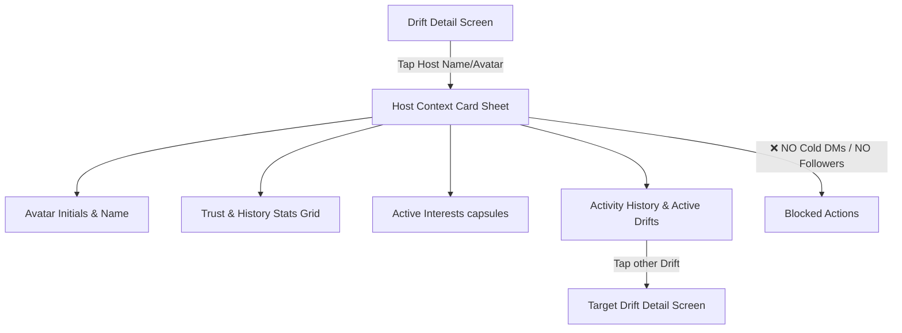

# CoffeeCall UX Decisions Spec (MVP Focus)

Status: ACTIVE  
Last updated: 2026-05-19

This document outlines the UX decisions, safety guardrails, and platform interactions for the CoffeeCall application's core product features. These decisions strictly prioritize **activity-first over people-browsing**, maintaining our commitment to a pure social, safe, and organic meetup experience.

---

## 1. ISSUE-013: Host Profile UX Direction from Drift Detail

### The Design Challenge
How to display the host of a Drift without turning the application into a profile-browsing catalog or dating simulator.

### UX Decision & Structure
Tapping the Host Avatar or Name in the **Drift Detail** screen does *not* open a dedicated social profile view or detail page. Instead, it presents a compact, read-only bottom sheet titled **Host Context Card**.

### Content Specification
1. **Host Identity**: Display first name and display initials only (e.g., `"Arjun A."`).
2. **Trust & History Stats Grid**: 
   - Renders a 2x2 miniature, Outfit-styled stats card grid showing:
     - **Hosted**: Total Drifts created by the user (e.g., `"4 Hosted"`).
     - **Joined**: Total Drifts they participated in (e.g., `"12 Joined"`).
     - **Verified**: A soft badge and checkmark confirming identity.
     - **Reliability**: Total completed check-ins (e.g., `"16 Completed"`).
3. **Interests Row**: A horizontal capsule line of the host's selected interest categories in Outfit style.
4. **Activity History & Active Drifts**:
   - **Active Drifts**: A mini vertical card list of upcoming drifts scheduled by this host. Tapping any item routes to its Drift Detail screen.
   - **Past Drifts Log**: A subtle horizontal scroll gallery of past completed meetups they hosted or joined (e.g., `"Walk in Indiranagar"`, `"Coffee chat"` with a grayed-out `"Completed"` state) to visually confirm real-world attendance.
5. **No Cold outreach**: Absolutely no direct message action, phone number display, or follow buttons.

---

## 2. ISSUE-014: "Who’s Coming" Sheet UX/Content Direction

### The Design Challenge
How to communicate participant synergy and safety before a user joins, while preventing group lists from becoming directory-browsing surfaces.

### UX Decision & Structure
Presented as an inline bottom sheet presented by tapping the participant avatars section on the **Drift Detail** screen.

- **Content**:
  - Title: `"Who's Coming"` with total accepted count.
  - A clean vertical scrollable list of participants showing their first name and display initials.
  - Directly next to each participant, a small, grayed row of **their active interest icons** (e.g., Walks `figure.walk`, Coffee `cup.and.saucer`) to serve as organic icebreakers.
  - A subtle secondary caption under each row: *"Joined this Drift today"*.
- **Guardrails**:
  - Entirely read-only list.
  - Tapping a participant does *not* open their profile, start a 1:1 chat, or reveal any personal contact info.

---

## 3. Drift List Filter UX Direction

### The Design Challenge
Providing users with a tactile search refinement tool while keeping filtering focused entirely on activities rather than personal demographic attributes.

### UX Decision & Structure
Filter button on the Drifts top header right slot opens a bottom refinement panel.

- **Refinement Inputs**:
  - **Discovery Radius**: A modern custom slider displaying `1 km` to `10 km` (the MVP hard-limit).
  - **Category Grid**: Interactive capsules corresponding to categories (Coffee, Walks, Movies, Food) that toggle list contents immediately.
  - **Timeframe Selector**: A segmented chip row: `All`, `Today`, `Tomorrow`, `This Weekend`.
- **Safety Guardrail**:
  - Filter parameters are strictly confined to drift attributes. Toggles for age, gender, occupation, or any user characteristics are structurally omitted.

---

## 4. Saved List Destination for Bookmark Action

### The Design Challenge
Where do bookmarked Drifts land and how does the user access them without cluttering the main tabs?

### UX Decision & Structure
Bookmarks represent temporary "watch lists" for active plans.
- **Placement**: Integrated directly inside the **"You" (Profile)** tab as a horizontal slider or dedicated row alongside the Activity Log.
- **Card States**:
  - Displays mini Drift cards with labels detailing status (*Open*, *Starting Soon*, *Completed*).
  - Tapping a saved card opens the Drift Detail page immediately.
  - If a bookmarked Drift expires or is cancelled, it is automatically faded and removed from the active list.

---

## 5. Reminder UX Destination/Behavior

### The Design Challenge
How to motivate attendance reliability without introducing punitive gamified scorecards or star ratings.

### UX Decision & Structure
- **Looming Warning**: 2 hours before a joined/hosted Drift begins, users receive a local push notification and an in-app banner:
  > *"Morning Walk starts in 2 hours! Verify your coordinates."*
- **Vibe Confirmation**: Tapping the reminder opens a simple bottom overlay in the chat room or detail page asking:
  > *"Are you still good to go?"*
  - **CTA 1 (Mint)**: `"Yes, on my way!"` (toggles their status badge to "Active/Confirmed" for other members).
  - **CTA 2 (Gray)**: `"Need to cancel"` (triggers a prompt allowing a brief explanatory message to the group, then handles exit).

---

## 6. Map/Location MVP Behavior

### The Design Challenge
How to use spatial visual feedback without converting the app into a map-first real-time tracking tool.

### UX Decision & Structure
- **Pre-Join State**:
  - The **Drift Detail** screen displays a circular, static mini-map showing a generic **500-meter radius colored highlight ring** (centered on the drift area) instead of a precise pin or street address.
  - Caption: *"Precise coordinate unlocks upon host acceptance."*
- **Post-Join State**:
  - Once accepted, the circular map transitions to display a sharp **pin drop** at the exact meeting point coordinates.
  - An inline button `"Open in Maps"` emerges, letting the user deep link directly into Apple Maps or Google Maps for navigation.
- **Guardrail**: No interactive map tab exists on the main navigation bar.

---

## 7. Handoff Notes for Implementation Agents

For agents building out these interfaces in future cycles, ensure you strictly adhere to the following SwiftUI composable standards:

1. **State & Triggers**:
   - Use simple SwiftUI sheets (`.sheet(isPresented:)`) for the *Host Context Card* and *Who's Coming* sheets.
   - Use `@ObservedObject` references to the shared view-models rather than creating localized state pools.
2. **Typography**:
   - All titles inside sheets must use **Outfit** semantic styles (e.g., `.font(.bodyBold)` or custom Outfit bindings).
   - Captions and names must use **SF Pro System** sizes to maintain legibility.
3. **No Direct Messaging**:
   - Never implement navigation hooks or destination variables connecting participant list rows to direct chat pathways.

---

## 8. Premium Prompts for UX Generation (One-by-One)

Use these detailed visual prompts to generate the corresponding user interface assets or high-fidelity screenshots:

### Prompt 1: Host Context Card bottom sheet
> "A high-fidelity iOS SwiftUI mockup of the CoffeeCall 'Host Context Card' bottom sheet, presented over a soft warm background (#F6F1EB). The card surface is clean ivory white (#FFFDF9) with a corner radius of 30pt. At the top, a circular avatar initials badge reads 'LM' in peach color, next to the bold text 'Liam M.' and a soft mint green verified seal. Directly below, a 2x2 grid of small soft cards displays Liam's real trust stats: '4 Hosted', '12 Joined', '16 Completed', and a verified checkmark. Below the grid, a row of three interest capsules shows 'Walks', 'Coffee', and 'Movies'. Underneath, a section titled 'Other Drifts by Liam' lists two compact card items with activity icons, alongside a subtle horizontal row showing small past completed drift cards labeled 'Completed' in gray. No direct messaging or call buttons are visible. The design feels premium, layered, and modern."

### Prompt 2: "Who's Coming" Sheet view
> "A high-fidelity mobile UI concept for CoffeeCall's 'Who's Coming' participant list sheet. Set on a warm cream surface (#FFFDF9) with soft slate shadows. A vertical list shows five participants with clean initials avatars. Next to each name, a horizontal stack of subtle interest icons (like a small mint walking figure and small coffee cup) is aligned cleanly. A subtitle reads 'Precise location is unlocked'. Safe, modern iOS layout with zero action buttons on the participant rows, reinforcing a safe read-only community design."

### Prompt 3: tactile Drifts Filter panel
> "A premium iOS bottom sheet filter panel for CoffeeCall. Features a beautiful horizontal slider for 'Discovery Radius' ranging from 1 km to 10 km, highlighted in mint green (#53B8A6). Below, a 2x3 grid of interactive interest capsule tags (Coffee, Walks, Movie, Dinner) with their respective mini vector outlines. At the bottom, a time picker chip segment shows 'All', 'Today', 'Tomorrow', 'This Weekend' in premium light peach and lavender accents. Warm minimalist design."
